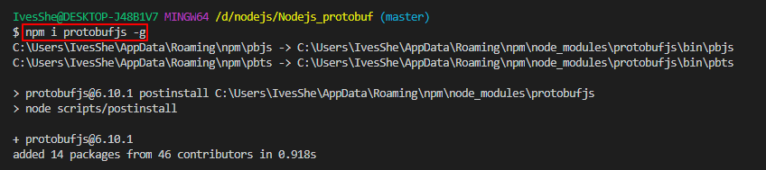
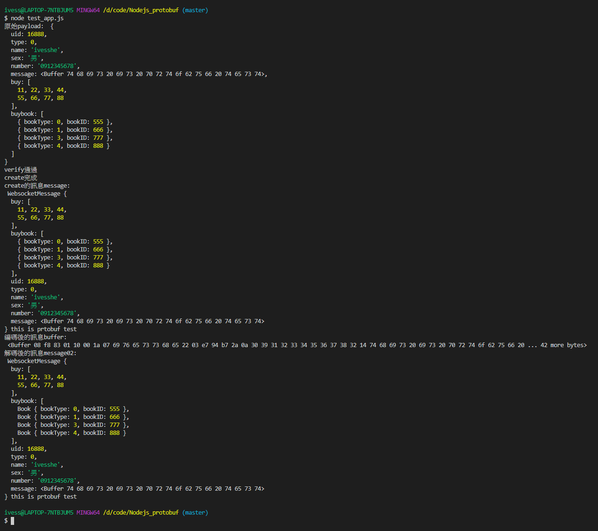
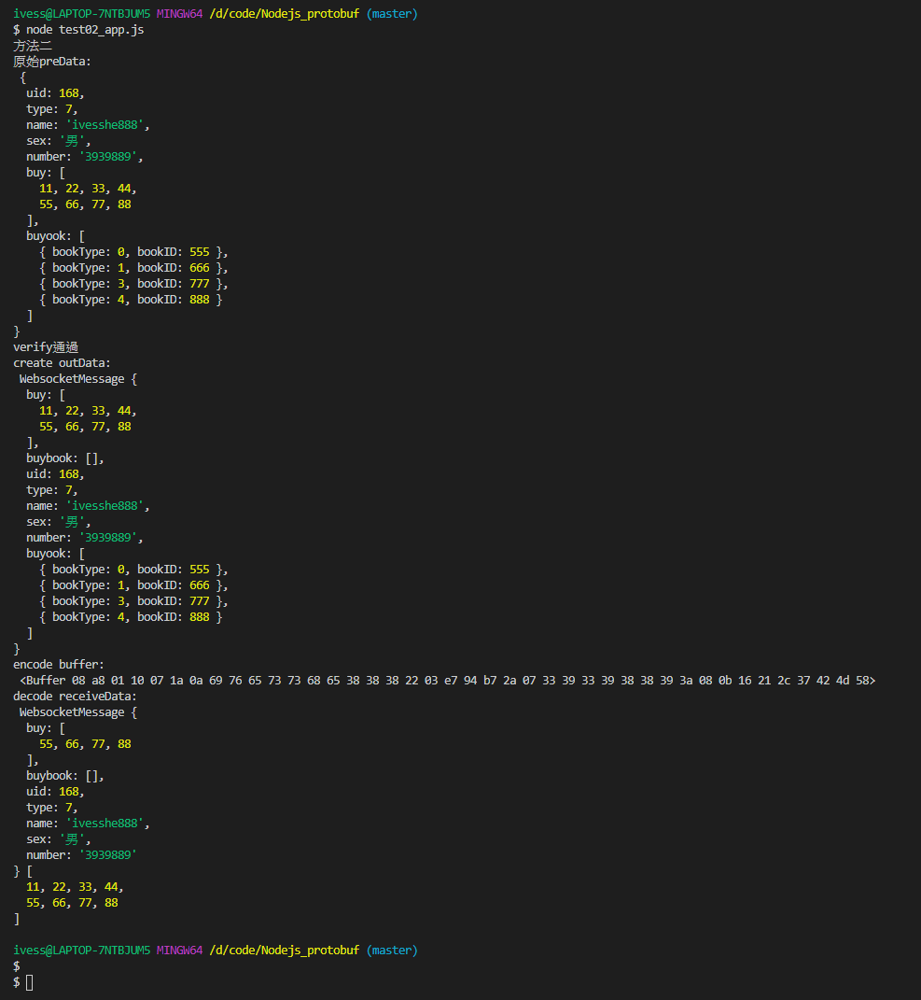

# Nodejs_protobuf

最近很常看到，所以瞭解一下

# 安裝protobufjs

要使用pbjs命令，所以加-g全局安裝

```shell
npm i protobufjs -g
```



# 將test.proto生成js

```shell
pbjs -t static-module -w commonjs -o test.js test.proto
```

生成d.ts(服務端不需要，但客戶端需要)

```shell
pbts -o test.d.ts test.js
```

# test.proto

```c
syntax = "proto3";  
package websocket;  // 包名
 
message WebsocketMessage {
    int32 uid =1;
    int32 type = 2;
    string name =3;
    string sex =4;
    string  number=5;
    bytes  message=6;
    repeated int32 buy = 7;     // 一般陣列
    message Book {
        int32 bookType = 1;
        int32 bookID = 2;
    }
    repeated Book buybook = 8; // 物件陣列 
 }
message Other {
    string Method =1;
	string From =2;
	string To=3;
	int32 Code=4;
    bytes  parameters=5;
} 
```

# 有兩種載入方法
- 直接讀取proto檔
- 載入由pbjs -t static-module -w commonjs -o test.js test.proto輸出的js檔

## 方法一：直接讀取proto

test_app.js
```js
// 方法一
// 直接讀取test.proto
const protobuf = require("protobufjs");

protobuf.load("./test.proto", function(err, root) {
    if (err)
        throw err;
 
    let WebsocketMessage = root.lookupType("websocket.WebsocketMessage");
    //var OtherMessage = root.lookupType("websocket.Other");
 
    let payload = { 
        uid:16888,
        type: 0,
        name:"ivesshe",
        sex:"男",
        number:"0912345678",
        message: Buffer.from("this is prtobuf test"),
       buy: [11,22,33,44,55,66,77,88],
        buybook:[
            {bookType:0,bookID:555},
            {bookType:1,bookID:666},
            {bookType:3,bookID:777},
            {bookType:4,bookID:888}
        ],
    };
    
    console.log("原始payload: ",payload);
    
    // 檢驗資料是否符合格式
    let errMsg = WebsocketMessage.verify(payload);
    if (errMsg)
        throw Error(errMsg);
   
    console.log("verify通過");   

    // 建立一組新訊息
    let message = WebsocketMessage.create(payload); 
    console.log("create完成");
    console.log("create的訊息message: \n",message,message.message.toString());    
   
    // 將資料編碼
    let buffer = WebsocketMessage.encode(message).finish();
    console.log("編碼後的訊息buffer: \n",buffer);

    // 將資料解碼
    let message02 = WebsocketMessage.decode(buffer);
    console.log("解碼後的訊息message02: \n",message02,message02.message.toString());
  
});
```

執行畫面



## 方法二：載入js檔的方式

```shell
// 方法二
// 使用pbjs -t static-module -w commonjs -o test.js test.proto輸出protobufjs
// 使用其輸出的js檔
var protobuf = require("./test");  

function protobufStudy(){
    console.log("方法二");    

    let preData = {};
    preData.uid = 168;
    preData.type = 7;
    preData.name = "ivesshe888";
    preData.sex = "男";
    preData.number = "3939889";
    preData.buy = [11,22,33,44,55,66,77,88],
    preData.buyook = [
        {bookType:0,bookID:555},
        {bookType:1,bookID:666},
        {bookType:3,bookID:777},
        {bookType:4,bookID:888}
    ];
    
    console.log("原始preData: \n",preData);

    // 檢驗資料是否符合格式
    let errMsg = protobuf.websocket.WebsocketMessage.verify(preData);
    if (errMsg)
        throw Error(errMsg);

    console.log("verify通過");    

    // 建立一組新訊息    
    let outData = protobuf.websocket.WebsocketMessage.create(preData);    
    console.log("create outData: \n",outData);

    // 將資料編碼
    let buffer = protobuf.websocket.WebsocketMessage.encode(outData).finish();
    console.log("encode buffer: \n",buffer);

    // 將資料解碼
    let receiveData = protobuf.websocket.WebsocketMessage.decode(buffer);
    console.log("decode receiveData: \n",receiveData,receiveData.buy);

}

protobufStudy();
```

執行畫面


